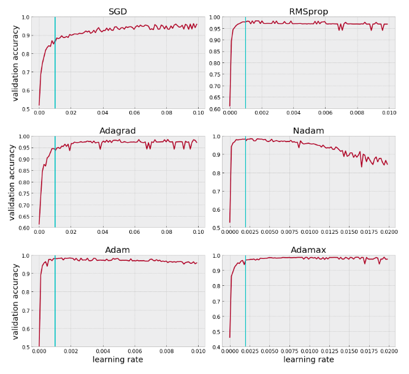
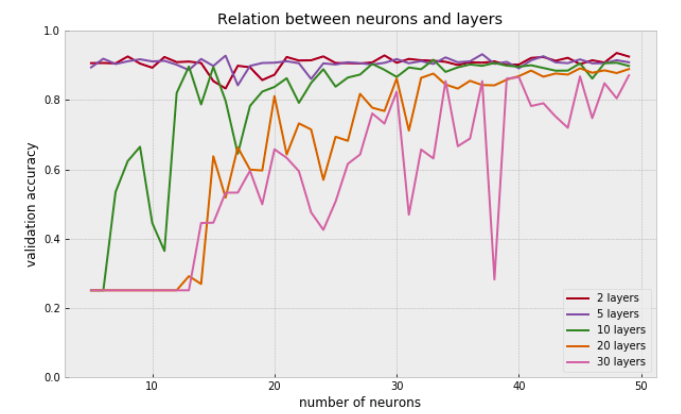

# Tests-on-the-parameters-behavior

As an example there were used datasets with binary predictions. The number of zeroes and ones is approximately even, so the validation accuracy which was used in the plots sufficiently describes the performance of the model.

## Batch size

### batch_size_small_range.py

The main task of this research is to find out how the value for the batch size influences the result. For the first test on there was taken a small range of batch sizes from 4 to 50 with the step of 1. With the optimum set of parameters the model was trained for each of the batch size of the list. The experiment was repeated ten times.
 The result may be seen in a following plot.

### batch_size_big_range.py

The same test was made for the bigger range. As it is better to take the value of the batch size as power of two for the better memory allocation, the range was chosen according to that - from 2 to 512. Only one experiment was made as the difference between values is enough big for the conclusion to be more evident.

### cocnlusion on the batch size test

Within the small ranges batch size doesn't have big influense. The value of 32 suits for the most of cases - it is power of two, not too big and not too small. In cases when it should be changed, big ranges should be taken into account (about 40-80 difference between values).

## Learning rate

### learning_rate.py

The task of this experiment is to see how a change of the value for different optimizers. For the test there were taken all of the optimizers which are available at Keras package. The range of the learning rate is calculated according to the initial value of lr. The final validation accuracy is the mean of three iterations to make the experiment cleaner. The vertical line on the plots corresponds to the initial learning rate value.

### conclusion on the learning rate test

Out of all optimizers which were checked only one of them is non-adaptive, i.e. the rest of them set the learning rate value individually for each case.
  The experiment showed that the change in lr value doesn't make sence for adaptive optimizers - it doesn't influence on the performance or makes the result even worse.

## Relation between the number of layers and neurons

### relation_between_layers_and_neurons.py

Both number of layers and number of neurons increase the complexity of the model. The task of the experiment is to show if these two parameters depend on each other. There were taken 7 numbers of layers from 1 to 30, and for each of them the model was trained with the different number of neurons (from 5 to 50).
  the result may be seen in a plot.

### conclusion on the neurons-layers test

Plot shows, that with the small amount of layers (up to 5) the number of neurons doesn't have too big influence, but with 10 layers or more the performance is worse if the value of neurons is too small.
