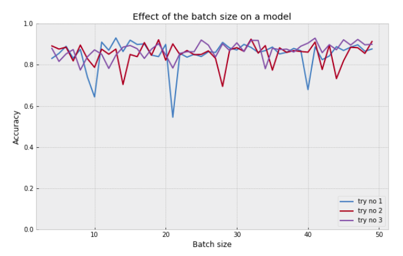
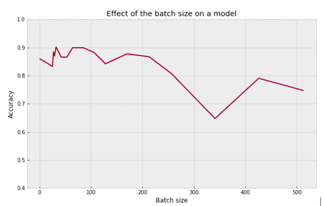

# Tests-on-the-parameters-behavior

## Batch size

### batch_size_small_range.py

The main task of this research is to find out how the value for the batch size influences the result. For the first test on there was taken a small range of batch sizes from 4 to 50 with the step of 1. With the optimum set of parameters the model was trained for each of the batch size of the list. The experiment was repeated ten times.
 The result may be seen in a following plot.

### batch_size_big_range.py

The same test was made for the bigger range. As it is better to take the value of the batch size as power of two for the better memory allocation, the range was chosen according to that - from 2 to 512. Only one experiment was maden as the difference between values is enough big for the conclusion to be more evident.

### cocnlusion about the batch size test

Within the small ranges batch size doesn't have big influense. The value of 32 suits for the most of cases - it is power of two, not too big and not too small. In cases when it should be changed, big ranges should be taken into account (about 40-80 difference between values).

